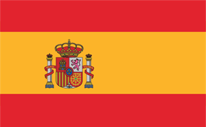

# Yo,Eu,I,Je

 

---

### Sobre Mim
Estudo três idiomas: inglês, francês e espanhol.
 

---

### Áreas de Interesse
- **Desenvolvimento de Software**
- **Machine Learning**
- **Cibersegurança**

---

### Contatos
- **Email** 📧: [0100101011001@proton.me](mailto:0100101011001@proton.me)
- **Discord** 🗨️: [jzzforlyfe](https://discordapp.com/users/jzzforlyfe)

---

### Curiosidades

**Interesse Principal:** Tentar criar um malware que afeta tudo que tem codigo binário.

**Último desafio:** Estudar 3 línguas diferentes e aprimorar a língua nativa. 

---

### Vamos Colaborar?
Estou sempre aberto a novas ideias e colaborações. Vamos criar algo incrível juntos!

